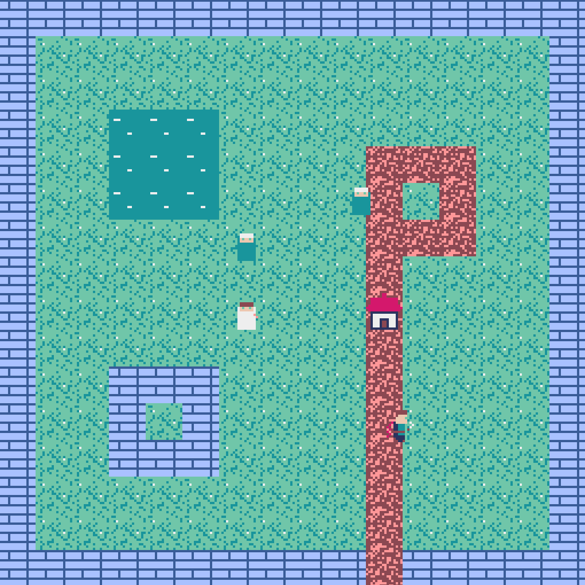
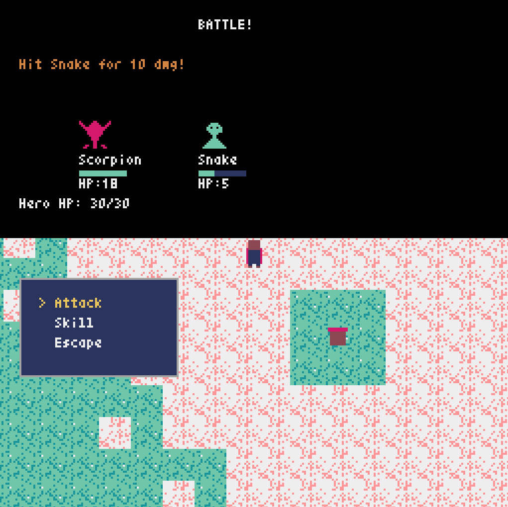

# CSFW RPG Demo

[日本語版はこちら](README.ja.md)

A demonstration project for **C-S Framework (CSFW)**.

CSFW is a Python framework that provides an event-driven architecture through Concepts and Synchronization rules. This repository demonstrates building a retro-style RPG game using CSFW.

👉 **CSFW Repository**: [https://github.com/shuntacurosu/cs-framework](https://github.com/shuntacurosu/cs-framework)

## Screenshots

| Field | Battle |
|:---:|:---:|
|  |  |

## Tech Stack

- **Framework**: [C-S Framework (CSFW)](https://github.com/shuntacurosu/cs-framework)
- **Graphics**: [Pyxel](https://github.com/kitao/pyxel) (Retro Game Engine)
- **Language**: Python 3.10+

## Architecture

This project follows the CSFW Concept-Synchronization pattern:

- **Concepts** (`src/concepts/`): Encapsulate game logic
  - `GameLoop`: Main loop & rendering
  - `Player`: Player state & movement
  - `MapSystem`: Map loading, collision, encounters
  - `BattleSystem`: Turn-based combat
  - `NpcSystem`: NPC management & AI movement
  - `MenuSystem`: Menu UI
  - etc.

- **Synchronizations** (`src/sync/rules.yaml`): Inter-concept coordination rules
  - Event-driven loose coupling
  - Declarative YAML definitions

## Setup

```bash
# Install dependencies
pip install cs-framework pyxel pyyaml pydantic

# Run
python src/main.py
```

## Controls

| Key | Action |
|-----|--------|
| Arrow Keys | Move |
| Z | Confirm / Talk |
| X | Cancel / Menu |

## License

MIT License
